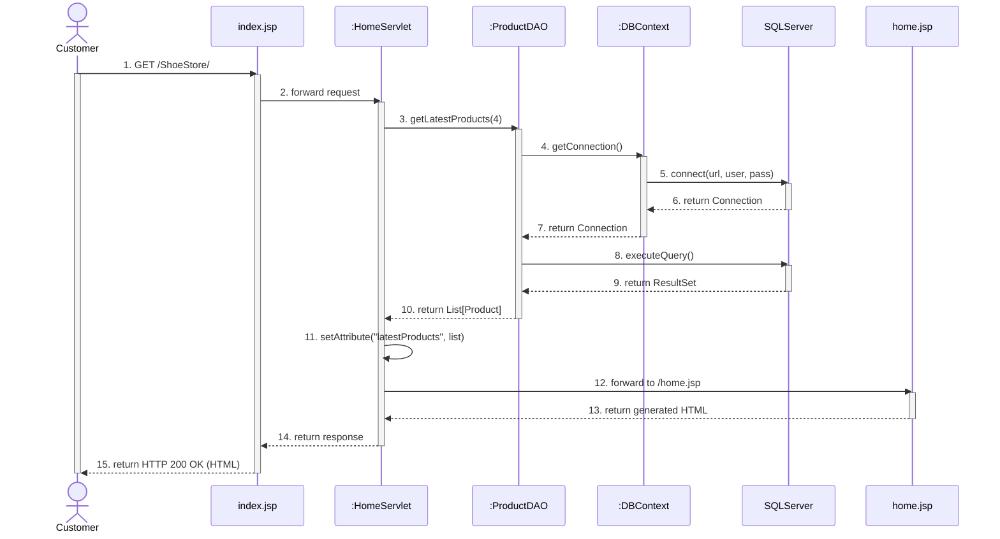

# Hướng Dẫn Sinh Biểu Đồ UML Tự Động (Sequence & Class Diagram)

File này lưu trữ các quy tắc và câu lệnh mẫu (prompt) để bạn có thể yêu cầu tôi tự động phân tích code và vẽ các biểu đồ UML (Sequence Diagram, Class Diagram,...) một cách chuẩn xác nhất cho project này.

## 1. Cấu trúc Prompt (Câu lệnh) khuyên dùng
Sau này, khi bạn code xong một tính năng mới (ví dụ như Đăng nhập, Thêm vào giỏ hàng) và muốn tôi vẽ biểu đồ, bạn chỉ cần copy và gửi câu lệnh sau:

> **"Hãy đọc file `UML_INSTRUCTIONS.md` và vẽ Sequence Diagram (Biểu đồ tuần tự) bằng code Mermaid cho chức năng [TÊN CHỨC NĂNG, vd: Login / Add to Cart]. Hãy phân tích kỹ các class Controller, DAO và Database liên quan."**

## 2. Tiêu chuẩn vẽ Biểu đồ (Dành cho AI)
Khi nhận được yêu cầu vẽ biểu đồ từ User, AI (tôi) phải tuân thủ các quy tắc sau:
- Sử dụng **Mermaid.js** (hoặc PlantUML) để có thể xem trực tiếp trên GitHub/Markdown.
- Phải thể hiện chi tiết các thành phần theo chuẩn MVC: **Actor (Người dùng) -> Controller (Servlet) -> Model/DAO -> Database -> View (JSP)**.
- Phải ghi rõ và chính xác tên các hàm được gọi trong source code (ví dụ: `doGet()`, `getConnection()`, `executeQuery()`).
- Tham khảo cú pháp UML Class Diagram chuẩn (Association, Aggregation, Composition, Generalization) từ tài liệu ĐH FPT (ảnh đính kèm) khi vẽ Class Diagram.

---

## 3. Example Sequence Diagram: "View Product List" (HomeServlet)

Here is the exact **Mermaid** code to generate the sequence diagram.

**How to use this in Draw.io:**
1. Open Draw.io.
2. Go to **Arrange > Insert > Mermaid...**.
3. Copy the code below, paste it in, and click Insert.
4. **Để làm cho Database thành hình trụ:** Sau khi Draw.io vẽ xong, bạn nhấp chuột vào ô chữ nhật `:SQLServer`, nhìn sang bảng **Style** bên phải màn hình, chọn một hình trụ (Cylinder) trong mục Shape để nó tự đổi thành hình trụ nhé!



## 4. Cách xem biểu đồ
- Bạn có thể cài đặt Extension **"Markdown Preview Mermaid Support"** trong VS Code.
- Hoặc đơn giản là copy đoạn code nằm giữa 3 dấu backtick (` ```mermaid ... ``` `) và dán vào trang web: **[Mermaid Live Editor](https://mermaid.live)** để xem và tải ảnh PNG về đưa vào báo cáo!
